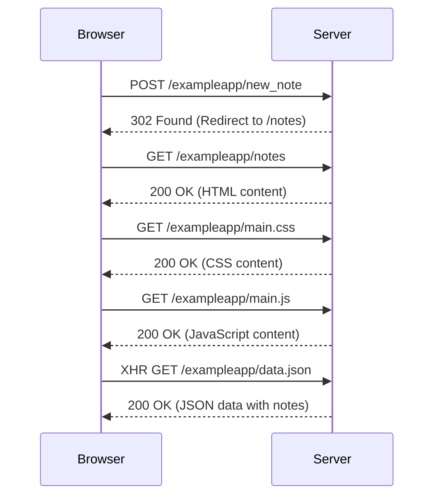

```mermaid
sequenceDiagram
    participant Browser
    participant Server

    Browser->>Server: POST /exampleapp/new_note
    Server-->>Browser: 302 Found (Redirect to /notes)

    Browser->>Server: GET /exampleapp/notes
    Server-->>Browser: 200 OK (HTML content)

    Browser->>Server: GET /exampleapp/main.css
    Server-->>Browser: 200 OK (CSS content)

    Browser->>Server: GET /exampleapp/main.js
    Server-->>Browser: 200 OK (JavaScript content)

    Browser->>Server: XHR GET /exampleapp/data.json
    Server-->>Browser: 200 OK (JSON data with notes)
```