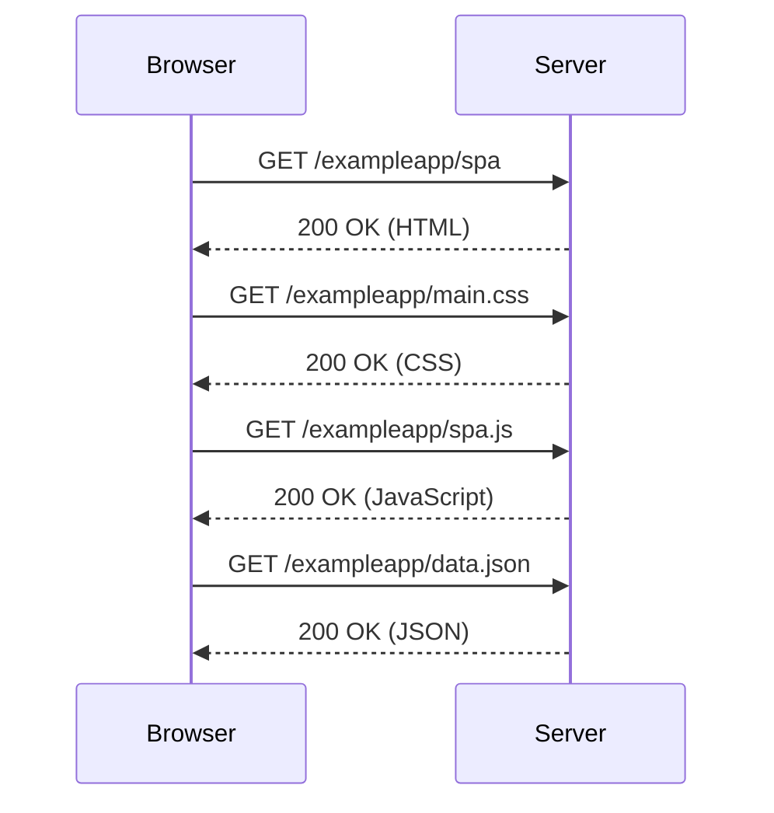

```mermaid
   sequenceDiagram
      participant Browser
      participant Server

      Browser->>Server: GET /exampleapp/spa
      Server-->>Browser: 200 OK (HTML)

      Browser->>Server: GET /exampleapp/main.css
      Server-->>Browser: 200 OK (CSS)

      Browser->>Server: GET /exampleapp/spa.js
      Server-->>Browser: 200 OK (JavaScript)

      Browser->>Server: GET /exampleapp/data.json
      Server-->>Browser: 200 OK (JSON)
```